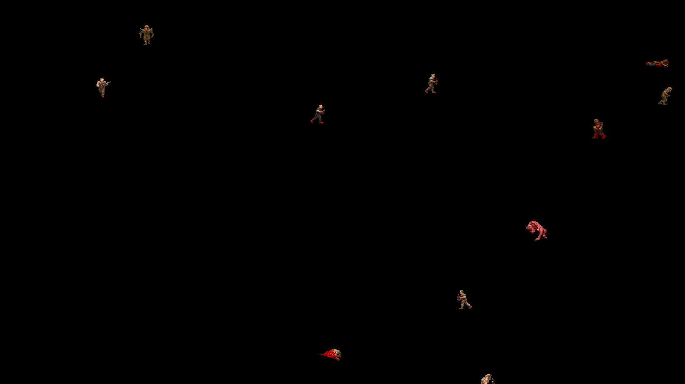

# DOOM-Screen-Saver

I'm a huge fan of Doom, so i've made this screensaver just for fun!



## Installation

Windows:

```sh
to-do
```
## Release History

* 1.0.0
    * First release

## To-Do

* Fix .png overlays
* Fix walking animations
* Add more monsters
* Make it configurable
* etc...

## Meta

Daniel Weise – dwb@gael.team

Distributed under the GNU General Public License v3.0 license. See ``LICENSE`` for more information.

[https://github.com/CollapsedMetal/DOOM-Screen-Saver](https://github.com/CollapsedMetal/DOOM-Screen-Saver)

## Contributing

1. Fork it (<https://github.com/CollapsedMetal/DOOM-Screen-Saver/fork>)
2. Create your feature branch (`git checkout -b feature/fooBar`)
3. Commit your changes (`git commit -am 'Add some fooBar'`)
4. Push to the branch (`git push origin feature/fooBar`)
5. Create a new Pull Request
